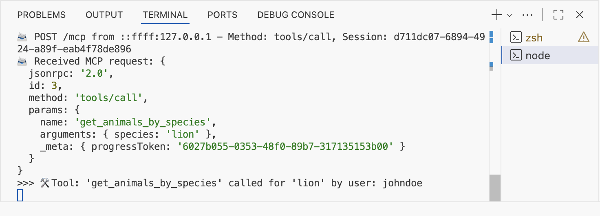
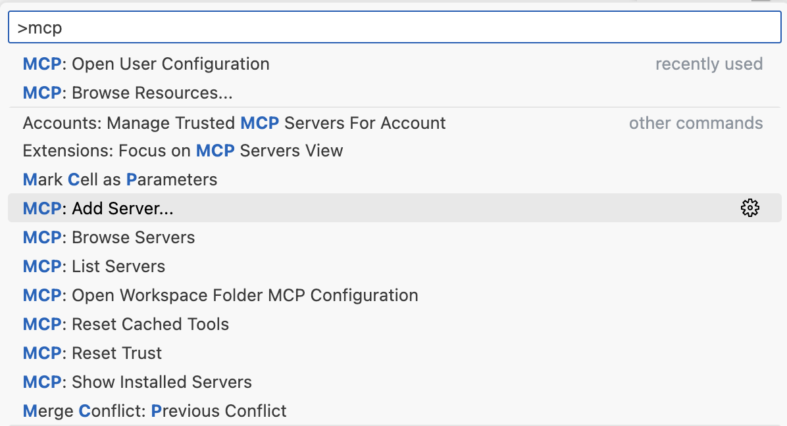
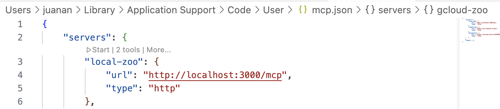
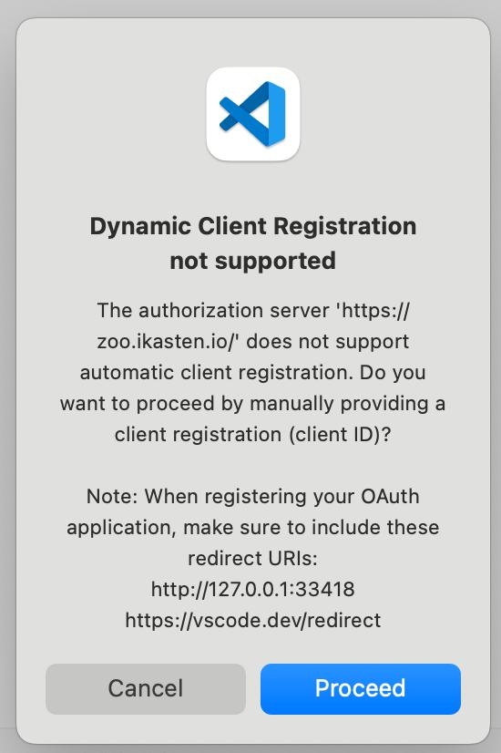
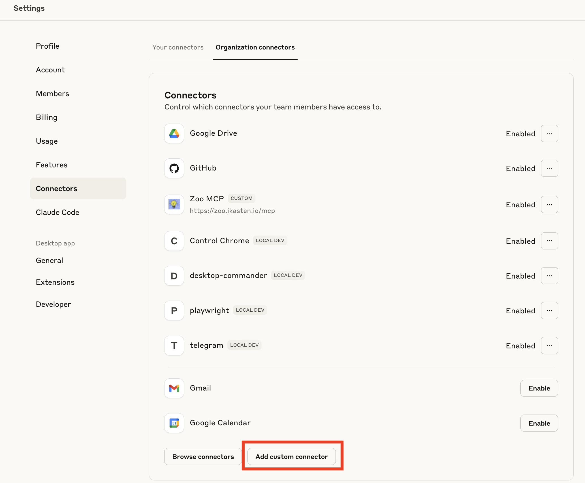
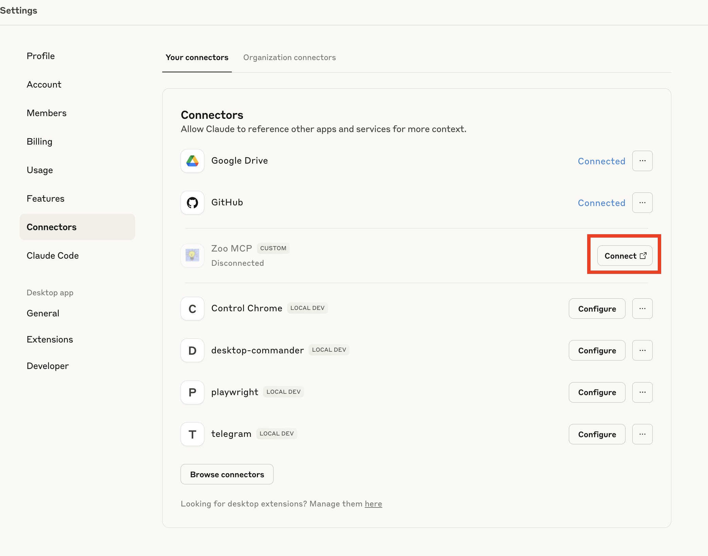
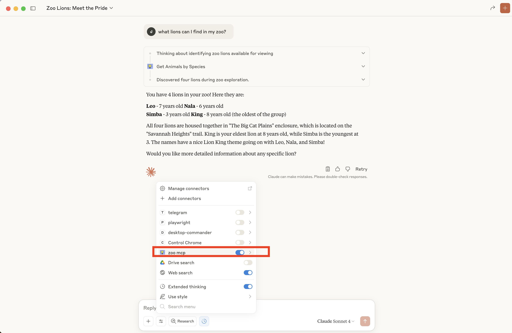

# ¿Cómo proteger un servidor MCP con autenticación OAUTH?

La nueva especifación de MCP permite proteger los recursos mediante la autenticación OAUTH 2.1: https://modelcontextprotocol.io/specification/draft/basic/authorization

Si te paras a leerla verás que es compleja de narices. Pero seguramente, si estás trabajando con MCP no te quedará más remedio que entenderla para usarla correctamente. Así que, agarra un café y vamos a estudiarla un rato. Asumo que ya conoces las bases de MCP, así que si no es caso, cierra esta pestaña y busca otras
referencias básicas. La idea es partir de un servidor MCP (Streamable HTTP) SIN autenticación, que ya implementa dos métodos básicos. A partir de ahí iremos estudiando qué demonios tenemos que implementar para conseguir añadirle autenticación.

## Punto de partida

He mantenido el endpoint GET /mcp para servidores MCP con SSE streams. La especificación MCP dice que el soporte http/sse está deprecated (es legacy). Así que únicamente podríamos dejar el endpoint POST /mcp... 


> **NOTE**: el código original del server MCP se basa en este código de un lab de Google:
https://codelabs.developers.google.com/codelabs/cloud-run/how-to-deploy-a-secure-mcp-server-on-cloud-run

He dejado el método DELETE para limpiar las estructuras de datos cuando la conexión MCP termina, pero es opcional. Tienes el código del punto de partida en este Gist:
https://gist.github.com/juananpe/7a282777fe5e602a1f56cf08e4b90d62
(ficheros basic.js y package.json)


Puedes lanzarlo así:

```bash
$ npm install
$ npm run basic                      

> zoo-animal-mcp-server@1.0.0 basic
> node basic.js

📡 MCP endpoint: http://localhost:3000/mcp
```

Para probarlo, abre el MCP Inspector.
 
```bash 
$ npx @modelcontextprotocol/inspector
```

En Transport Type elige "Streamable HTTP". En URL, introduce: http://localhost:3000/mcp. Pulsa en "Connect".  Luego Pulsa en List Tools. Deberías de poder ver y ejecutar dos herramientas: get_animal_by_species y get_animal_details. 
Si no recuerdas bien cómo funciona MCP, échale un vistazo a este post donde lo explicaba:
https://ikasten.io/2024/12/15/model-context-protocol-mcp-el-puente-entre-tus-aplicaciones-y-modelos-llm/


# Añadiendo autenticación OAUTH básica

En [streamablemcpserver.js](https://gist.github.com/juananpe/7a282777fe5e602a1f56cf08e4b90d62#file-streamablemcpserver-js) he dejado una versión con autenticación OAUTH básica.
Lo primero que haremos será pasar un nuevo parámetro `authInfo` a las tools, que llevará info sobre el usuario que la está ejecutando.

```js
async ({ species }, { authInfo }) => {
```

Pero la primera magia está aquí:
```js
app.post("/mcp", authenticateToken, async (req, res) => {
```

El segundo parámetro, authenticateToken es una función middleware quue determinará
si el usuario nos ha enviado un token de autenticación válido o no.

```js
function authenticateToken(req, res, next) {
  const authHeader = req.headers["authorization"];
  const token = authHeader && authHeader.split(" ")[1]; // Bearer TOKEN

  if (!token) {
    return res.status(401).json({ error: "Access token required" });
  }

  const decoded = verifyAccessToken(token);
  if (!decoded) {
    return res.status(403).json({ error: "Invalid or expired token" });
  }

  req.user = {
    id: decoded.sub,
    scopes: decoded.scopes,
  };
  next();
}
```

Si no hay token (el usuario no se ha autenticado) enviamos un 401, tal y como dicta
la especificación: 
https://modelcontextprotocol.io/specification/2025-03-26/basic/authorization

    "When authorization is required and not yet proven by the client, servers MUST respond with HTTP 401 Unauthorized."

Y ahí el cliente empieza a bailar al son de OAuth 2.1 IETF DRAFT (un draft del Internet Engineering Task Force que pasará a RFC si todo va bien https://datatracker.ietf.org/doc/html/draft-ietf-oauth-v2-1-12)

El draft dice que cuando un server MCP emite un código 401, el cliente debe ir a buscar un fichero JSON a esta ruta conocida: `/.well-known/oauth-authorization-server`

> **Note**: Según la [especificación](https://modelcontextprotocol.io/specification/2025-06-18/basic/authorization#authorization-server-discovery) MCP de 2025-06-18, el cliente puede lanzar una petición GET a `/.well-known/oauth-protected-resource` para obtener la URL del authorization-server. Si no la encuentra, asume que el servidor MCP actúa también como authorization-server. Más fácil (así que es lo que usaremos en esta versión).

En jerga, dice que que "MCP clients MUST follow the OAuth 2.0 Authorization Server Metadata protocol defined in [RFC8414](https://datatracker.ietf.org/doc/html/rfc8414#section-3)." Y si seguimos la pista del RFC8414 veremos que nos lleva a esa ruta `/.well-known/oauth-authorization-server`.

Así que nuestro server MCP debe ofrecer un endpoint ahí, con un buen puñado de URLs y parámetros:

```js
// OAuth Authorization Server Metadata (RFC 8414)
app.get("/.well-known/oauth-authorization-server", (req, res) => {
  const base = getBaseUrl(req);
  res.json({
    issuer: base,
    authorization_endpoint: `${base}/authorize`,
    token_endpoint: `${base}/token`,
    jwks_uri: `${base}/.well-known/jwks.json`,
    response_types_supported: ["code"],
    grant_types_supported: ["authorization_code", "refresh_token"],
    code_challenge_methods_supported: ["S256"],
    scopes_supported: OAUTH_CONFIG.scopes,
    token_endpoint_auth_methods_supported: ["client_secret_post"],
    subject_types_supported: ["public"],
  });
});
```

Los servidores no están obligados a ofrecer ese endpoint. Si no lo hacen, el cliente debe ir a buscar los endpoints que necesita siguiendo este patrón:

https://api.example.com/authorize
https://api.example.com/token
https://api.example.com/register

Pero en nuestro caso sí ofrecemos los metadata endpoints. Así que, ¿ahora qué?

Ahora el server podría implementar o no el OAuth 2.0 Dynamic Client Registration Protocol para permitir a los cliente MCP obtener dinámicamente un ID de Cliente (sin preguntar nada al usuario). De momento no lo haremos (el usuario tendrá que
interactuar).


Así que, directamente el cliente irá a por el authorization_endpoint (`/authorize`).
Ahí podemos servir una página HTML para que el usuario se identifique (vía Google o login&pass) y después redirigirlo a /callback. A /authorize llegará una petición con estos parámetros rellenados por el cliente (este ejemplo proviende de una request generada por el cliente MCP de VS Code)

```js
{
  client_id: 'zoo-animal-mcp-client',
  response_type: 'code',
  code_challenge: 'oBuDWc9aSEWXUCR3GVwLrO1V23WVmhqoAZeuUKkfkgI',
  code_challenge_method: 'S256',
  scope: 'read_animals list_animals',
  redirect_uri: 'http://127.0.0.1:33418',
  state: 'cywD6O8BkkfMpMQJfJ04Jg=='
}
```

Los valores de scope provienen de los metadatos. El client_id lo hemos tenido que picar a mano en VS Code cuando nos lo ha pedido (por no haber implementado aún el OAuth 2.0 Dynamic Client Registration). El resto de parámetros los ha inyectado VS Code automáticamente.

Ahora habría que identificar al usuario, pero para esta demo, aprobamos la petición directamente, sin login ni gaitas (es una demo, recuerda, estamos intentando simplificar todo el tinglado). Generamos un random code y un random userId y pa'lante.

```js
// In a real implementation, you would show a login/consent screen
// For this demo, we'll auto-approve
  const authCode = generateAuthorizationCode();
  const userId = "demo-user-" + randomUUID(); // In real app, get from authenticated user

  // Store authorization code with PKCE details
  authorizationCodes.set(authCode, {
    clientId: client_id,
    redirectUri: redirect_uri,
    scope: scope || OAUTH_CONFIG.scopes.join(" "),
    userId: userId,
    codeChallenge: code_challenge,
    codeChallengeMethod: code_challenge_method,
    expiresAt: Date.now() + 10 * 60 * 1000, // 10 minutes
  });
```

Ese bloque the authorizationCodes, con el codeChallenge, userId, scopes y parámetros OAuth, se lo pasamos al cliente (enviándoselo a la redirect_uri que el cliente nos dijo):

```js
const redirectUrl = new URL(redirect_uri);)
```

Con ese authorizationCodes, el cliente pedirá cambiarlo por un access token (un token JWT):

```js
app.post("/token", (req, res) => {
```
    
El servidor MCP recibirá un token request como este: 

```js
{
  grant_type: 'authorization_code',
  code: 'a6e885aa-ba4b-4738-aaa5-380dcbd7a6d8',
  client_id: 'zoo-animal-mcp-client'
}
```

Ahora, si el código es correcto, no está caducado y no requiere de secretId (o si requiere, el secretId es correcto), entonces generamos un access_token y un refresh_token para el cliente, userId y scope:

```js
    res.json({
      access_token: accessToken,
      token_type: "Bearer",
      expires_in: 3600, // 1 hour
      refresh_token: refreshToken,
      scope: authData.scope,
    });
```

> **Note**: Un cliente puede enviar un refresh_token al principio de la conversación, indicando
> que ya fue autenticado en su momento y que lo único que quieres es renovar el auth token sin pasar
> por el proceso de identificación del usuario. Eso sí, el cliente MCP tendrá que enviar el 
> refresh_token y un GET /authorize con el client_id y scope, para identificar al cliente. Algo así:
>
> ```
> 🎫 POST /token from ::ffff:127.0.0.1 with grant_type: refresh_token
> 🎫 Token request received: {
>   grant_type: 'refresh_token',
>   code: undefined,
>   client_id: 'zoo-animal-mcp-client'
> }
> 🔐 GET /authorize from ::1 with params: [Object: null prototype] {
>   client_id: 'zoo-animal-mcp-client',
>   response_type: 'code',
>   code_challenge: 'iWdqZiaenjAVRldq6DHhk02OkNaYk3aAEBHWUS2LGc4',
>   code_challenge_method: 'S256',
>   scope: 'read_animals list_animals',
>   redirect_uri: 'http://127.0.0.1:33418',
>   state: 'iC32busOJ27LXtnBnGgreA=='
> }
> ```

Y con ese access_token (JWT), por fin, el cliente MCP ya puede empezar a lanzar peticiones MCP (para empezar, un `initialize` y a continuación un listado de tools `tools/list`), enviando siempre en el Bearer el access_token de marras que tanto nos ha costado obtener.

## Identificando al usuario

Lo que hemos construido hasta ahora está muy bien pero aceptamos cualquier usuario (¡no hay proceso de login!). Vamos a arreglar eso añadiendo un pequeño form con un dos simples campos de login y password. Por simplificar, de momento solo aceptaremos dos usuarios: johndoe o janedoe. El password será pass para ambos. 

Creamos un fichero `a`uthorize.html con el formulario y lo llamamos desde GET /authorize. 

```js
// OAuth Authorization Endpoint
app.get("/authorize", (req, res) => {
  console.log(`🔐 GET /authorize from ${req.ip} with params:`, req.query);
  // Serve the login form
  res.sendFile(path.join(process.cwd(), "authorize.html"));
});
```

Nos identificamos y al lanzar la primera tool, podremos ver que el server MCP sabe que el userID que ha lanzado la petición es johndoe (o janedoe).



He dejado en [streamablewithauth.js](https://gist.github.com/juananpe/7a282777fe5e602a1f56cf08e4b90d62#file-streamablewithauth-js) y [authorize.html](https://gist.github.com/juananpe/7a282777fe5e602a1f56cf08e4b90d62#file-authorize-html) la nueva versión por si quieres trastear.

## Usando el MCP Server desde VS Code

Hemos visto cómo programar todo... pero igual no estás familiarizado con la configuración del server en VS Code. Rápidamente:

Command+Shift+P: abrimos la paleta de comandos. Desde ahí tecleamos "mcp" para ver todos los comandos disponibles relacionados con mcp.



A continuación elegimos HTTP server. Tecleamos la URL del servidor (http://localhost:3000/mcp o si ya hemos desplegado, la url del servidor remoto, https://tudominio/mcp). Si te pide clientId y secretId, consulta tu `.env` buscando los valores de OAUTH_CLIENT_ID=zoo-animal-mcp-client y 
OAUTH_CLIENT_SECRET=your-secure-client-secret-here.

Se generará un fichero JSON de configuración de los MCP aquí `~/Library/Application Support/Code/User/mcp.json`



Si ejecutas los pasos indicados, verás que al principio, VS Code arrojará el siguiente warning:



Esto provoca que el usuario tenga que introducir el clientID de forma manual y después seguir un enlace que nos mostrará VS Code para autorizar al cliente (te devolverá un código que tendrás que pegar en VS Code para seguir). Esto funciona OK, pero es un peñazo para el usuario.  Así que tendremos que implementar soporte DCR (Dynamic Client Registration) para poder lanzar nuestro server desde Claude Desktop (o desde VS Code, sin tener que pasar manualmente datos del cliente)

## Dynamic Client Registration

Siguiendo la [especificación](https://modelcontextprotocol.io/specification/2025-06-18/basic/authorization#dynamic-client-registration) más reciente (2025-06-18), podemos ver que DCR es opcional (should implement, no es un must):

> MCP clients and authorization servers SHOULD support the OAuth 2.0 Dynamic Client Registration Protocol RFC7591 to allow MCP clients to obtain OAuth client IDs without user interaction.

Básicamente, añadimos un nuevo endpoint (`registration_endpoint`) al JSON que informa de los servicios de autenticación:

```js
// OAuth Authorization Server Metadata (RFC 8414)
app.get("/.well-known/oauth-authorization-server", (req, res) => {
  console.log(`📋 GET /.well-known/oauth-authorization-server from ${req.ip}`);
  const base = getBaseUrl(req);
  res.json({
    issuer: base,
    authorization_endpoint: `${base}/authorize`,
    token_endpoint: `${base}/token`,
    registration_endpoint: `${base}/register`,
    jwks_uri: `${base}/.well-known/jwks.json`,
    response_types_supported: ["code"],
    grant_types_supported: ["authorization_code", "refresh_token"],
    code_challenge_methods_supported: ["S256"],
    scopes_supported: OAUTH_CONFIG.scopes,
    token_endpoint_auth_methods_supported: ["client_secret_post"],
    subject_types_supported: ["public"],
  });
});
```

Ese /register (que ya habíamos visto antes) servirá para que el cliente MCP se auto-registre e identifique. El cliente llamará vía POST a /register, enviando un buen puñado de variables:

```js
// OAuth Dynamic Client Registration Endpoint
app.post("/register", (req, res) => {
  console.log(`📝 POST /register from ${req.ip} - Client registration request`);
  console.log("📝 Registration request body:", req.body);

  try {
    const {
      redirect_uris,
      client_name,
      client_uri,
      logo_uri,
      scope,
      grant_types,
      response_types,
      token_endpoint_auth_method,
      contacts,
    } = req.body;
```

Guardamos la info del cliente, y devolvemos un http/201 con todo lo que hemos guardado:

```js
// Return client information according to OAuth 2.0 Dynamic Client Registration spec
    res.status(201).json({
      client_id: clientId,
      client_secret: clientSecret,
      client_id_issued_at: now,
      client_secret_expires_at: 0, // 0 means no expiration
      redirect_uris: redirect_uris,
      client_name: client_name || "MCP Client",
      client_uri: client_uri,
      logo_uri: logo_uri,
      scope: scope || OAUTH_CONFIG.scopes.join(" "),
      grant_types: grant_types || ["authorization_code"],
      response_types: response_types || ["code"],
      token_endpoint_auth_method:
        token_endpoint_auth_method || "client_secret_post",
      contacts: contacts || [],
    });
```

Aquí un problema que tuve es que cada cliente pasa una serie de URLs de callback. De momento las he ido metiendo todas en un .env de callbacks autorizados.

Y ahora sí, desde Claude Desktop: Settings / Connectors / Organization Connectors / Add custom connector.



Ahora, desde "Your Connectors", conectamos el conector (¡nunca mejor dicho!)



Y veremos que Claude lanza una petición de registro con los siguientes valores
(los valores POST /authorize son las credenciales por defecto que usamos en este ejemplo)

```
📋 GET /.well-known/oauth-authorization-server from ::ffff:127.0.0.1
🔐 GET /authorize from ::ffff:127.0.0.1 with params: [Object: null prototype] 
   response_type: 'code',
   client_id: '93a26150-8b99-46f9-a4f1-1ac23b10051a',
   redirect_uri: 'https://claude.ai/api/mcp/auth_callback',
   code_challenge: '7d1a_aDTP6ZYwrD2nvjDvTOy_yPgyK87qNiGmI2N-Ek',
   code_challenge_method: 'S256',
   state: 'Yc7ED6D-op_v2evWmJgMmJ2mhmD9jlczAzcN_fdsE3M',
   scope: 'read_animals list_animals',
   resource: 'https://zoo.ikasten.io/mcp'
 
 🔐 POST /authorize from ::ffff:127.0.0.1 - Login attempt for: johndoe
 ✅ Valid login for user: johndoe
 ✅ Generated authorization code: 0e11475b-d07a-4ab0-926f-9226d74d3a64 for user: johndoe
 📋 GET /.well-known/oauth-authorization-server from ::ffff:127.0.0.1
 🎫 POST /token from ::ffff:127.0.0.1 with grant_type: authorization_code
 🎫 Token request received: {
   grant_type: 'authorization_code',
   code: '0e11475b-d07a-4ab0-926f-9226d74d3a64',
   client_id: '93a26150-8b99-46f9-a4f1-1ac23b10051a'
 }
```

¡Y listo! Ya tenemos el conector lanzado para hacerle preguntas:



He dejado en este Gist la [versión con DCR del servidor MCP](https://gist.github.com/juananpe/7a282777fe5e602a1f56cf08e4b90d62#file-streamablewithdcr-js).


## CODA

Llegar hasta aquí ha sido un laaargo viaje. La idea es que todos los pasos se pueden simplificar usando proveedores de autenticación externos: [Keycloak](https://www.keycloak.org/), [Auth0](https://auth0.com/), [Clerk](https://clerk.com/), [Logto](https://logto.io/), [ScaleKit](https://www.scalekit.com/)... y frameworks del estilo [MCP-Auth](https://mcp-auth.dev/), pero quería aprender desde cero cómo funciona este infierno de OAuth 2.1 en MCP :) Es un placer lanzar todo y controlar todo en tu propio servidor con tus propios endpoints. Eso sí, NO es una buena idea usar lo visto en este post directamente en producción. Usad proveedores externos, que han sido probados a conciencia y han tenido en cuenta multitud de detalles de seguridad que en este artículo hemos obviado.

Si te ha gustado este post y quieres aprender más al respecto (por ejemplo, cómo desplegar todo esto en producción), te animo a que te apuntes a la lista de espera del [curso que estoy impartiendo sobre Agentes IA](https://mikrokredentzialak.ehu.eus/es/curso/agentes-ia) en la UPV/EHU, donde vemos en detalle, a través de proyectos reales, cómo trabajar con MCP, LangGraph, OpenAI Agents SDK y el framework de evaluación Arize Phoenix.